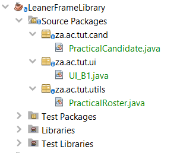
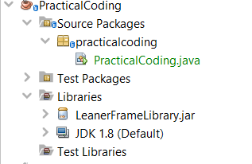
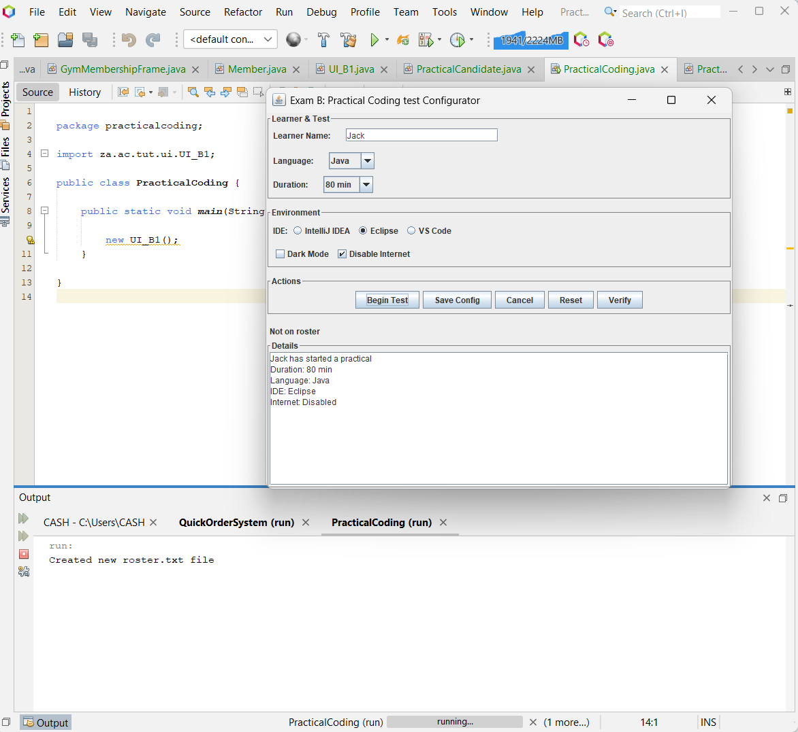
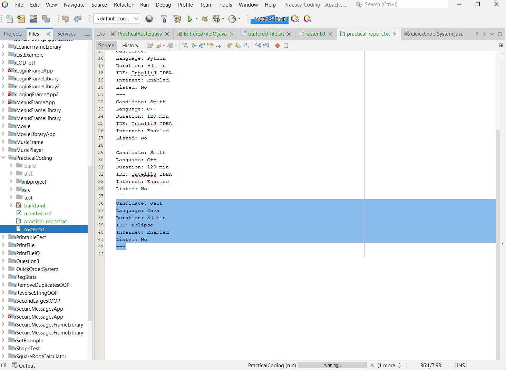

# Practical Coding Test Configurator

A Java Swing desktop application designed for managing practical coding tests with features for roster verification, session logging, and configuration management.

## Features
-  Learner registration and test configuration
-  Roster management and verification
-  Session logging and report generation
-  Form validation and data persistence
-  Clean, intuitive GUI interface

## Project Structure

## Results
### Application Interface

### Session Reports

## Technologies
- Java Swing
- File I/O Operations
- Object-Oriented Programming
- MVC Architecture

## Usage
1. Enter learner details and test configuration
2. Use verification to validate inputs
3. Begin test to log sessions and generate reports
4. Save configurations for future use

---
*Built with Java Swing - Perfect for educational institutions and coding bootcamps*
